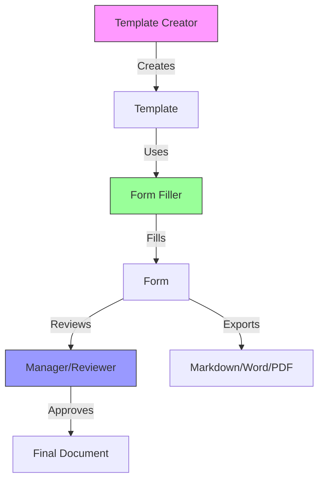
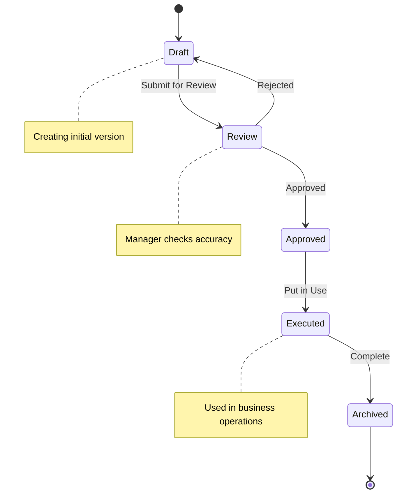
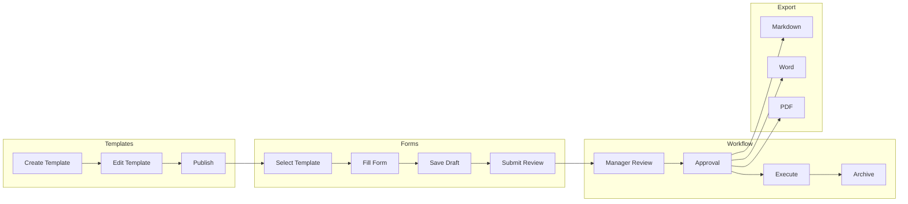

# Template & Form Process Diagrams

This document shows the workflows for templates and forms, including user roles and processes.

---

## 1. Template Creation to Form Completion Flow



---

## 2. Document Lifecycle



---

## 3. User Roles & Responsibilities

```
┌─────────────────────────────────────────────────────────────────┐
│                    USER ROLES FLOWCHART                         │
├─────────────────────────────────────────────────────────────────┤
│                                                                 │
│   ┌──────────────┐                                            │
│   │   ADMIN      │  • Create company                         │
│   │              │  • Manage users                            │
│   │  (Owner)     │  • Configure settings                     │
│   └──────┬───────┘  • View all forms                         │
│          │                                                      │
│          ▼                                                      │
│   ┌──────────────┐                                            │
│   │  TEMPLATE    │  • Create templates                        │
│   │  CREATOR     │  • Edit templates                         │
│   │              │  • Define fields                           │
│   └──────┬───────┘  • Set categories                          │
│          │                                                      │
│          ▼                                                      │
│   ┌──────────────┐                                            │
│   │ FORM FILLER  │  • Fill forms                             │
│   │  (User)      │  • Save drafts                            │
│   │              │  • Export documents                        │
│   └──────┬───────┘  • Submit for review                       │
│          │                                                      │
│          ▼                                                      │
│   ┌──────────────┐                                            │
│   │  REVIEWER    │  • Review forms                            │
│   │  (Manager)   │  • Approve/reject                         │
│   │              │  • Add comments                            │
│   └──────┬───────┘  • Sign off                                │
│          │                                                      │
│          ▼                                                      │
│   ┌──────────────┐                                            │
│   │  EXECUTOR   │  • Use final document                      │
│   │  (Employee) │  • Follow procedures                        │
│   │              │  • Complete tasks                          │
│   └──────────────┘                                            │
│                                                                 │
└─────────────────────────────────────────────────────────────────┘
```

---

## 4. Template Categories & Users

```
┌────────────────────────────────────────────────────────────────────────────┐
│                    TEMPLATE CATEGORIES BY USER                            │
├────────────────────────────────────────────────────────────────────────────┤
│                                                                            │
│  CATEGORY          │ TEMPLATES              │ PRIMARY USERS              │
│  ─────────────────┼────────────────────────┼──────────────────────────  │
│                    │                        │                            │
│  📋 SOPs          │ • Onboarding          │ HR, IT, Operations        │
│                    │ • Incident Response   │ Security Team              │
│                    │ • Change Mgmt        │ IT Manager                │
│                    │ • Access Mgmt         │ IT, Security              │
│                    │ • Vendor Mgmt          │ Procurement               │
│                    │ • Data Backup         │ IT                        │
│                    │ • Physical Security   │ Facilities                │
│                    │ • SaaS Selection      │ IT, Procurement           │
│                    │ • SaaS Onboarding     │ IT, HR                   │
│                                                                            │
│  📁 PROJECT       │ • Project Charter      │ PM, Sponsor               │
│                    │ • Status Report       │ PM, Team                  │
│                    │ • Meeting Notes       │ Any team member           │
│                    │ • RACI Matrix         │ PM, Team Lead             │
│                    │ • Risk Register       │ PM, Stakeholders          │
│                    │ • Decision Log        │ PM, Leadership            │
│                    │ • Retrospective       │ Team                      │
│                                                                            │
│  👥 HR            │ • Employee Handbook   │ HR, Leadership            │
│                    │ • Job Description     │ HR, Hiring Manager        │
│                    │ • Performance Review  │ Manager, HR               │
│                    │ • IT Onboarding      │ IT, HR                   │
│                                                                            │
│  💰 FINANCE       │ • Invoice             │ Sales, Accounting        │
│                    │ • Expense Report      │ Employees                │
│                    │ • Budget Tracker      │ Managers, Finance        │
│                    │ • Equipment Inventory │ IT, Facilities           │
│                                                                            │
│  📊 EXECUTIVE    │ • Board Update        │ CEO, CFO                 │
│                    │ • QBR                 │ Leadership               │
│                    │ • OKR Tracker        │ All levels               │
│                                                                            │
│  ⚖️ LEGAL         │ • NDA                 │ Legal, Sales             │
│                    │ • Contractor Agreement│ HR, Legal                │
│                    │ • Employment Offer    │ HR                       │
│                    │ • Privacy Policy     │ Legal, Compliance        │
│                    │ • Terms of Service   │ Legal, Product           │
│                                                                            │
│  📢 MARKETING    │ • Campaign Brief      │ Marketing                │
│                                                                            │
│  🤝 CUSTOMER     │ • Success Plan        │ Customer Success         │
│    SUCCESS           │                            │                            │
│                                                                            │
│  ⚙️ OPERATIONS  │ • Maintenance Log     │ Operations, IT           │
│                    │ • Shift Handover     │ Operations               │
│                    │ • Client Onboarding  │ Sales, CS               │
│                                                                            │
│  🏥 HEALTHCARE   │ • HIPAA Policy        │ Compliance, HR            │
│                                                                            │
│  🏗️ CONSTRUCTION │ • Project Checklist   │ Project Manager          │
│                                                                            │
│  🏪 RETAIL       │ • Store Opening      │ Operations               │
│                                                                            │
└────────────────────────────────────────────────────────────────────────────┘
```

---

## 5. Review & Approval Workflow

```
┌─────────────────────────────────────────────────────────────────────────┐
│                    DOCUMENT REVIEW WORKFLOW                               │
├─────────────────────────────────────────────────────────────────────────┤
│                                                                         │
│   ┌─────────┐     ┌─────────┐     ┌─────────┐     ┌─────────┐         │
│   │ CREATE  │────▶│  DRAFT  │────▶│ SUBMIT  │────▶│ REVIEW │         │
│   │         │     │         │     │         │     │        │         │
│   └─────────┘     └─────────┘     └─────────┘     └────┬────┘         │
│                                                         │              │
│                                                         ▼              │
│                              ┌─────────────┐     ┌─────────┐          │
│                              │  REJECTED   │◀────│ APPROVE │          │
│                              │  (Go back)  │     │         │          │
│                              └─────────────┘     └────┬────┘          │
│                                                         │              │
│                                                         ▼              │
│                                                 ┌─────────┐          │
│                                                 │ FINAL   │          │
│                                                 │ DOC    │          │
│                                                 └────┬────┘          │
│                                                      │                │
│                                                      ▼                │
│                                              ┌─────────┐            │
│                                              │EXECUTE/│            │
│                                              │ARCHIVE │            │
│                                              └─────────┘            │
│                                                                         │
└─────────────────────────────────────────────────────────────────────────┘

APPROVAL MATRIX:

┌─────────────────────┬──────────┬────────────┬────────────┐
│ Document Type       │ Creator  │ Reviewer   │ Approver   │
├─────────────────────┼──────────┼────────────┼────────────┤
│ SOPs                │ Dept Lead │ Manager   │ Director   │
│ HR Policies         │ HR       │ HR Lead   │ CEO        │
│ Contracts (>$5K)     │ Sales    │ Legal     │ CFO        │
│ Budget              │ Manager  │ Finance   │ CEO        │
│ Project Charter     │ PM       │ Sponsor   │ Steering   │
│ Invoices            │ Sales    │ Accounting│ Manager    │
│ Press Releases      │ Marketing│ Legal     │ CEO        │
└─────────────────────┴──────────┴────────────┴────────────┘
```

---

## 6. Form to Document Process

```
┌─────────────────────────────────────────────────────────────────────────┐
│                    TEMPLATE → FORM → DOCUMENT                          │
├─────────────────────────────────────────────────────────────────────────┤
│                                                                         │
│  TEMPLATE (Blueprint)                                                 │
│  ═══════════════════                                                  │
│  • Reusable structure                                                 │
│  • Placeholders for data                                              │
│  • Standard sections                                                  │
│  • Can be used 100s of times                                         │
│                                                                         │
│  Example: Invoice Template                                            │
│  ┌──────────────────────────────────────┐                           │
│  │ Invoice                               │                           │
│  │                                       │                           │
│  │ Company: {{COMPANY_NAME}}             │                           │
│  │ Client: {{CLIENT_NAME}}               │                           │
│  │ Amount: ${{AMOUNT}}                   │                           │
│  │                                     │                           │
│  └──────────────────────────────────────┘                           │
│                              │                                        │
│                              ▼                                        │
│  FORM (Filled Out)                                                  │
│  ══════════════════                                                  │
│  • One instance of template                                          │
│  • Data filled in                                                   │
│  • Saved to database                                                │
│                                                                         │
│  Example: January Invoice #001                                       │
│  ┌──────────────────────────────────────┐                           │
│  │ Invoice                               │                           │
│  │                                       │                           │
│  │ Company: Acme Corp                    │                           │
│  │ Client: John Smith                   │                           │
│  │ Amount: $5,000                       │                           │
│  │                                     │                           │
│  └──────────────────────────────────────┘                           │
│                              │                                        │
│                              ▼                                        │
│  DOCUMENT (Final Output)                                             │
│  ══════════════════════                                              │
│  • Exported version                                                  │
│  • Ready to use/send                                                │
│  • No placeholders                                                   │
│                                                                         │
│  Output Formats:                                                     │
│  • 📄 Markdown (.md)                                                 │
│  • 📝 Word (.docx)                                                  │
│  • 📑 PDF (.pdf)                                                    │
│  • 📧 Email                                                         │
│                                                                         │
└─────────────────────────────────────────────────────────────────────────┘
```

---

## 7. Full Process Overview



---

## 8. User Journey Map

```
┌─────────────────────────────────────────────────────────────────────────┐
│                    USER JOURNEY: CREATING A FORM                       │
├─────────────────────────────────────────────────────────────────────────┤
│                                                                         │
│  DISCOVERY                                                            │
│  ═════════                                                            │
│  • Lands on dashboard                                                 │
│  • Sees template categories                                           │
│  • Searches for needed template                                        │
│                                                                         │
│        │                                                              │
│        ▼                                                              │
│                                                                         │
│  SELECTION                                                            │
│  ══════════                                                           │
│  • Clicks template                                                   │
│  • Reviews required fields                                            │
│                                                                         │
│        │                                                              │
│        ▼                                                              │
│                                                                         │
│  CREATION                                                             │
│  ═════════                                                            │
│  • Fills in fields                                                   │
│  • Adds custom content                                               │
│  • Reviews preview                                                   │
│                                                                         │
│        │                                                              │
│        ▼                                                              │
│                                                                         │
│  SAVE                                                                 │
│  ═══                                                                 │
│  • Saves to database                                                  │
│  • Gets confirmation                                                 │
│  • Can continue editing                                              │
│                                                                         │
│        │                                                              │
│        ▼                                                              │
│                                                                         │
│  REVIEW (Optional)                                                    │
│  ═══════                                                             │
│  • Submits to manager                                                │
│  • Manager reviews                                                   │
│  • Approved or rejected                                              │
│                                                                         │
│        │                                                              │
│        ▼                                                              │
│                                                                         │
│  EXPORT/EXECUTE                                                      │
│  ═══════════════                                                     │
│  • Exports to desired format                                          │
│  • Uses document                                                      │
│  • Shares with others                                                │
│                                                                         │
└─────────────────────────────────────────────────────────────────────────┘
```

---

## 9. Data Flow Diagram

```
┌─────────────────────────────────────────────────────────────────────────┐
│                         DATA FLOW                                      │
├─────────────────────────────────────────────────────────────────────────┤
│                                                                         │
│                                                                         │
│   ┌─────────┐      ┌─────────┐      ┌─────────┐      ┌─────────┐   │
│   │ Input   │ ───▶ │ Process │ ───▶ │ Store   │ ───▶ │ Output  │   │
│   │ Data    │      │         │      │         │      │         │   │
│   └─────────┘      └─────────┘      └─────────┘      └─────────┘   │
│       │                │                │                │          │
│       ▼                ▼                ▼                ▼          │
│   ┌─────────┐      ┌─────────┐      ┌─────────┐      ┌─────────┐   │
│   │ User    │      │ Flask   │      │ SQLite  │      │ Export  │   │
│   │ Fills   │      │ App     │      │ DB      │      │ Files   │   │
│   │ Fields  │      │ Validates│     │ Forms   │      │ MD/DOCX │   │
│   └─────────┘      └─────────┘      └─────────┘      └─────────┘   │
│                                                                         │
│   DATABASE TABLES:                                                    │
│   ───────────────                                                     │
│   • users - User accounts                                             │
│   • companies - Company info                                          │
│   • templates - Template definitions                                   │
│   • forms - Filled forms                                             │
│   • form_fields - Individual field values                             │
│   • form_versions - Version history                                   │
│                                                                         │
└─────────────────────────────────────────────────────────────────────────┘
```

---

*Diagrams for Template Business Manager*
